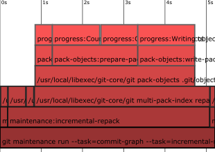

Generate flamegraphs from Git trace2 data
=========================================

You can generate trace2 event data for a Git command as follows:

```
GIT_TRACE2_EVENT="$(pwd)/trace.txt" \
        GIT_TRACE2_EVENT_DEPTH=100 \
        git <arguments>
```

To install and run the conversion tool, use the following:

```
npm install -g derrickstolee/trace2-flamegraph
npx derrickstolee/trace2-flamegraph <trace.txt >trace.svg
```

You can then open the SVG in your browser or
[favorite SVG editor](https://inkscape.org/) to see output such as this:



The text labels might be cluttered, so use your favorite editor to modify
the flamegraphs as you please. You can also combine multiple flamegraphs
to demonstrate a change in performance:


License
-------

`trace2-flamegraph` is available via the MIT License.
